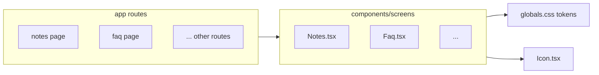

# feat: Design all ComingSoon prototype screens

## Summary

Replace thirteen `ComingSoon` placeholder routes with dedicated client screen components under `components/screens/`, each shaped for its real job (notes, knowledge base, tools library, feedback, settings hub, account, helpdesk, broadcasts, token usage, admin roster, and three integration consoles). Reuse established layout and token patterns from `components/screens/Email.tsx`, `Dashboard.tsx`, and global utilities in `app/globals.css` so the prototype feels like one product.

---

## Problem Frame

The sidebar exposes many destinations, but only six areas ship full UI (`Dashboard`, `Intelligence`, `Social`, `Composer`, `Email`, `Projects`). The remaining routes render `components/ComingSoon.tsx`, which blocks demos and hides whether navigation IA matches real work. The gap is purely presentational for this prototype: no API contracts yet, but screens must read as credible and efficient for each task.

---

## Requirements

- R1. Every route that currently imports `ComingSoon` must render a purpose-built screen component instead (same route paths, no nav changes required).
- R2. Visual language must align with existing screens: terracotta primary, paper/ink neutrals, `page-header` / `page-title` / `page-sub`, cards, tabs/toolbars where appropriate, `Icon` usage, light/dark via `data-theme` (already set in `Shell`).
- R3. Each screen’s layout must reflect its primary user job (e.g., notes = capture + browse + search; integrations = status + sync controls + activity), not generic marketing filler.
- R4. UX efficiency: primary actions visible above the fold; dense lists paired with search/filter; minimize clicks for common paths (open item, create item, change status).
- R5. `app/*/page.tsx` files stay thin: default export imports one screen component, mirroring `app/email/page.tsx` and `app/dashboard/page.tsx`.

**Origin actors:** (none — no upstream requirements doc)

**Origin flows:** (none)

**Origin acceptance examples:** (none)

---

## Scope Boundaries

- No real OAuth, webhooks, billing, or persistence; mock data and disabled or noop primary buttons are acceptable where a backend does not exist.
- No redesign of `Shell`, `Sidebar`, or `Topbar` except tiny string consistency fixes if discovered (e.g., breadcrumb label drift).
- No new npm dependencies unless a screen truly cannot be built with current stack (Next 15, React 18, CSS in `globals.css`).

### Deferred to Follow-Up Work

- Automated UI or visual regression tests (repo has no `test` script today); add Playwright or similar in a separate change if stakeholders want CI coverage.
- Wiring forms to APIs, RBAC for Super Admins, and real integration health from Zoho/Apollo/GA.

---

## Context & Research

### Relevant Code and Patterns

- **Designed references:** `components/screens/Email.tsx` (page header + tabs + toolbar + grid), `components/screens/Dashboard.tsx` (widgets, charts, density), `components/screens/Projects.tsx`, `Social.tsx`, `Composer.tsx`, `Intelligence.tsx`.
- **Placeholder pattern:** `components/ComingSoon.tsx`; consumers listed via grep in `app/*/page.tsx` for: `account`, `broadcast`, `admins`, `feedback`, `settings`, `notes`, `tokens`, `helpdesk`, `faq`, `tools`, `apollo`, `zoho`, `ga`.
- **Layout shell:** `components/Shell.tsx` defines breadcrumbs per route; keep labels in sync when renaming page titles.
- **Tokens and components:** `app/globals.css` (BrandPulse palette, shadows, radii), `components/Icon.tsx` for glyph set.
- **Routing:** `app/page.tsx` and `app/dashboard/page.tsx` both mount `Dashboard`; other routes one file each.

### Institutional Learnings

- None under `docs/solutions/` in this repository.

### External References

- None required — local patterns are sufficient for static prototype UI.

---

## Key Technical Decisions

- **One screen file per route (not one mega file):** Keeps diffs reviewable and matches existing `components/screens/*` convention.
- **Client components for interactivity:** Use `"use client"` on new screens that need tabs, filters, drawers, or local editor state (same as `Email.tsx`).
- **Mock data colocated:** Constants or small in-file fixtures per screen; no shared mock DB unless duplication becomes painful (then extract in a follow-up).
- **Integration trio shares pattern:** Zoho, Apollo, and GA screens use the same scaffold (connection banner, sync toggles, field mapping table stub, recent sync log) with copy/icons swapped — speeds delivery and keeps UX consistent.
- **Testing posture:** Manual acceptance only for this slice; document scenarios per unit. Automated tests explicitly deferred.

---

## Open Questions

### Resolved During Planning

- **Real backends?** No — prototype stays static/noise data.
- **Brand naming (`Prism` vs `BrandPulse`)?** Keep UI copy consistent with sidebar where possible; optional micro-edit to align `Shell` crumb for `/notes` with sidebar label in same PR or defer.

### Deferred to Implementation

- Exact copy for empty states and legal/disclaimer text on integration pages.
- Whether feedback submissions should show a toast only or also append to a local list (implementer choice; both fine for prototype).

---

## High-Level Technical Design

> *This illustrates the intended approach and is directional guidance for review, not implementation specification. The implementing agent should treat it as context, not code to reproduce.*

Each new screen: top `page-header` (title + subtitle + optional primary actions) → optional `tabs` / `toolbar` → main content (`card` grids, split panes, or tables) → secondary panels (drawers/modals as lightweight `div` overlays using existing styles if present, or new scoped classes in `globals.css`).

---

## Implementation Units

- U1. **[Prism Notes — note-taking workspace]**

**Goal:** Ship a credible notes hub: notebook list, note list, editor pane, search, pinned items, mock collaborators.

**Requirements:** R1–R5

**Dependencies:** None

**Files:**
- Create: `components/screens/Notes.tsx`
- Modify: `app/notes/page.tsx`

**Approach:** Three-column or two-column responsive layout: narrow notebooks, mid note titles + metadata, main rich-text-style editor (plain `textarea` or `contentEditable` optional — keep simple). Toolbar: New note, search, sort. Use `tabs` only if separating “My notes” / “Shared” helps; otherwise segmented control.

**Patterns to follow:** Density and headers from `Email.tsx`; warm surfaces from `globals.css`.

**Test scenarios:**
- Happy path: select notebook → select note → body shows; edit text → local state updates.
- Edge case: search filters list to zero → empty state with reset.
- Test expectation: none — no automated harness; verify manually per Verification.

**Verification:** Route `/notes` shows structured note UI, not `ComingSoon`; theme toggle does not break layout.

---

- U2. **[FAQs and Announcements hub]**

**Goal:** Combine knowledge articles and org announcements with clear separation.

**Requirements:** R1–R5

**Dependencies:** None

**Files:**
- Create: `components/screens/Faq.tsx`
- Modify: `app/faq/page.tsx`

**Approach:** `tabs`: FAQs | Announcements. FAQs: searchable list + categories + article reader panel. Announcements: chronological cards with priority badge (info/warning). Pin “Unread” filter for efficiency.

**Patterns to follow:** Tab strip from `Email.tsx`; card list from existing card primitives in CSS.

**Test scenarios:**
- Happy path: switch tabs; open FAQ entry → reader shows body.
- Edge case: empty search shows empty state.
- Test expectation: none — manual.

**Verification:** `/faq` demonstrates both modes with mock content.

---

- U3. **[Tools and Resources library]**

**Goal:** Centralize links, files, and templates for the team with quick filter and launch actions.

**Requirements:** R1–R5

**Dependencies:** None

**Files:**
- Create: `components/screens/Tools.tsx`
- Modify: `app/tools/page.tsx`

**Approach:** Toolbar: search + type filter (Brand, Templates, Links). Grid of resource cards with icon, description, primary “Open” / “Copy link”. Optional tag chips.

**Patterns to follow:** Grid density similar to `email-grid` / card patterns.

**Test scenarios:**
- Happy path: filter narrows cards; open button noop with `aria-label` is fine.
- Test expectation: none — manual.

**Verification:** `/tools` shows categorized resource cards with working filters (client-side).

---

- U4. **[Submit Feedback form]**

**Goal:** Fast structured feedback: category, severity, subject, details, optional attachment stub.

**Requirements:** R1–R5

**Dependencies:** None

**Files:**
- Create: `components/screens/Feedback.tsx`
- Modify: `app/feedback/page.tsx`

**Approach:** Single-column form + right rail “What happens next” card. Primary submit shows inline success state (no backend). Include spam-safe honeypot field optional (low priority).

**Patterns to follow:** Form controls styled with existing `btn-primary`, inputs from toolbar search styles.

**Test scenarios:**
- Happy path: fill required fields → submit → success panel.
- Error path: submit with empty subject → inline validation.
- Test expectation: none — manual.

**Verification:** `/feedback` validates required fields client-side and confirms submission UX.

---

- U5. **[Settings hub]**

**Goal:** Surface workspace, notifications, branding, and integration sub-settings as a navigable hub.

**Requirements:** R1–R5

**Dependencies:** None

**Files:**
- Create: `components/screens/Settings.tsx`
- Modify: `app/settings/page.tsx`

**Approach:** Left vertical subnav (or horizontal tabs on small screens) + content panel: Workspace, Branding, Notifications, Integrations (links deep-link to `/zoho` etc. as secondary buttons). Use toggles and select controls with local state.

**Patterns to follow:** Tab/subnav feel from `Email.tsx`.

**Test scenarios:**
- Happy path: change toggle → state updates; navigate subsections.
- Test expectation: none — manual.

**Verification:** `/settings` shows multiple subsections without `ComingSoon`.

---

- U6. **[Account profile]**

**Goal:** Profile summary, security placeholders, session devices list mock.

**Requirements:** R1–R5

**Dependencies:** None

**Files:**
- Create: `components/screens/Account.tsx`
- Modify: `app/account/page.tsx`

**Approach:** Header card with avatar + name + role; sections for Login & security (password change button disabled), Active sessions table, Preferences (locale, theme hint text only if not duplicating topbar).

**Patterns to follow:** Card stack from dashboard aesthetic.

**Test scenarios:**
- Happy path: page renders coherent sections.
- Test expectation: none — manual.

**Verification:** `/account` accessible from sidebar popover route; no `ComingSoon`.

---

- U7. **[Helpdesk inbox]**

**Goal:** Ticket queue with SLA-ish badges, filters, and preview pane.

**Requirements:** R1–R5

**Dependencies:** None

**Files:**
- Create: `components/screens/Helpdesk.tsx`
- Modify: `app/helpdesk/page.tsx`

**Approach:** Split view: filterable table (id, subject, requester, status, updated) + detail stub on selection. Quick actions: Assign, Change status (local).

**Patterns to follow:** Toolbar + dense list like email templates list tone.

**Test scenarios:**
- Happy path: select row → detail updates.
- Edge case: zero tickets after filter → empty state.
- Test expectation: none — manual.

**Verification:** `/helpdesk` demonstrates queue + detail pattern.

---

- U8. **[Feature Broadcasts feed]**

**Goal:** Chronological product updates with read/unread and filter by product area.

**Requirements:** R1–R5

**Dependencies:** None

**Files:**
- Create: `components/screens/Broadcast.tsx`
- Modify: `app/broadcast/page.tsx`

**Approach:** Feed cards (title, date, version tag, body excerpt, CTA link noop). Mark-as-read toggles per card in local state.

**Patterns to follow:** Card timeline, subtle status colors from CSS tokens.

**Test scenarios:**
- Happy path: mark read reduces unread counter in header region.
- Test expectation: none — manual.

**Verification:** `/broadcast` shows interactive read state locally.

---

- U9. **[AI Token Usage dashboard]**

**Goal:** Usage by model, by user (mock), period selector, quota progress.

**Requirements:** R1–R5

**Dependencies:** None

**Files:**
- Create: `components/screens/Tokens.tsx`
- Modify: `app/tokens/page.tsx`

**Approach:** Summary tiles + bar chart or stacked bars using simple `div` bars (no chart lib) + table of top “consumers”. Time range segmented control (7d / 30d / 90d).

**Patterns to follow:** Widget cards from `Dashboard.tsx` for KPI tiles.

**Test scenarios:**
- Happy path: switching range updates displayed numbers (mock swap).
- Test expectation: none — manual.

**Verification:** `/tokens` communicates usage story at a glance.

---

- U10. **[Super Admins roster]**

**Goal:** Admin table with roles, last active, invite flow (modal stub), destructive action guarded.

**Requirements:** R1–R5

**Dependencies:** None

**Files:**
- Create: `components/screens/Admins.tsx`
- Modify: `app/admins/page.tsx`

**Approach:** Table + Invite admin button → modal with email field; confirm adds row locally. Remove opens confirm dialog (browser `confirm` acceptable for prototype).

**Patterns to follow:** Buttons and badges from existing CSS.

**Test scenarios:**
- Happy path: invite adds admin to table.
- Error path: invalid email format → validation message.
- Test expectation: none — manual.

**Verification:** `/admins` supports add/remove in local mock state.

---

- U11. **[Zoho CRM integration console]**

**Goal:** Connection status, sync direction overview, mapping table stub, activity log.

**Requirements:** R1–R5

**Dependencies:** None

**Files:**
- Create: `components/screens/ZohoIntegration.tsx`
- Modify: `app/zoho/page.tsx`

**Approach:** Use shared integration layout pattern (banner, metrics row, toggles, table, log). Zoho-specific entities: Accounts, Contacts, Deals.

**Patterns to follow:** Same card/button language as rest of app.

**Test scenarios:**
- Happy path: toggle “Sync enabled” updates banner state.
- Test expectation: none — manual.

**Verification:** `/zoho` reads as CRM sync control center.

---

- U12. **[Apollo.io integration console]**

**Goal:** Prospecting sync controls, enrichment credits meter (mock), sequence stub.

**Requirements:** R1–R5

**Dependencies:** U11 (copy integration shell pattern established there; implement after U11 or duplicate structure if parallelizing)

**Files:**
- Create: `components/screens/ApolloIntegration.tsx`
- Modify: `app/apollo/page.tsx`

**Approach:** Same shell as U11 with Apollo-specific sections (Sequences, Prospects, Enrichment usage).

**Test scenarios:**
- Happy path: credits widget reflects slider or preset (mock).
- Test expectation: none — manual.

**Verification:** `/apollo` distinct from Zoho but visually related.

---

- U13. **[Google Analytics integration console]**

**Goal:** Property selector, key events table, sync status, link to reporting (noop).

**Requirements:** R1–R5

**Dependencies:** U11

**Files:**
- Create: `components/screens/GaIntegration.tsx`
- Modify: `app/ga/page.tsx`

**Approach:** Same integration shell; focus on property ID, streams, conversion events.

**Test scenarios:**
- Happy path: property select changes displayed event list (mock).
- Test expectation: none — manual.

**Verification:** `/ga` completes integration trio with analytics framing.

---

## System-Wide Impact

- **Interaction graph:** Only `app/*/page.tsx` imports change to new screens; `Shell` crumbs may need label tweaks when screen `h1` titles finalize.
- **Error propagation:** None — client-only mock paths.
- **State lifecycle risks:** Prefer colocated `useState`; no global store introduced.
- **API surface parity:** N/A.
- **Integration coverage:** N/A for backend.
- **Unchanged invariants:** Existing designed screens (`Dashboard`, `Email`, etc.) should not regress; avoid renaming CSS classes used by them.

---

## Risks & Dependencies

| Risk | Mitigation |
|------|------------|
| CSS class collisions when adding large new blocks | Prefer BEM-like prefixed section class names per screen (e.g., `.notes-layout`) scoped in `globals.css` additions. |
| Bundle size growth from thirteen client screens | Acceptable for prototype; avoid heavy deps. |
| Inconsistent copy (Prism vs BrandPulse) | Quick editorial pass in same implementation wave. |

---

## Documentation / Operational Notes

- After implementation, optional one-line entry in root `README.md` listing screen inventory (only if README exists and lists features).

---

## Sources & References

- **Origin document:** none
- Related code: `components/screens/Email.tsx`, `components/ComingSoon.tsx`, `components/Shell.tsx`, `app/globals.css`
- External docs: none
