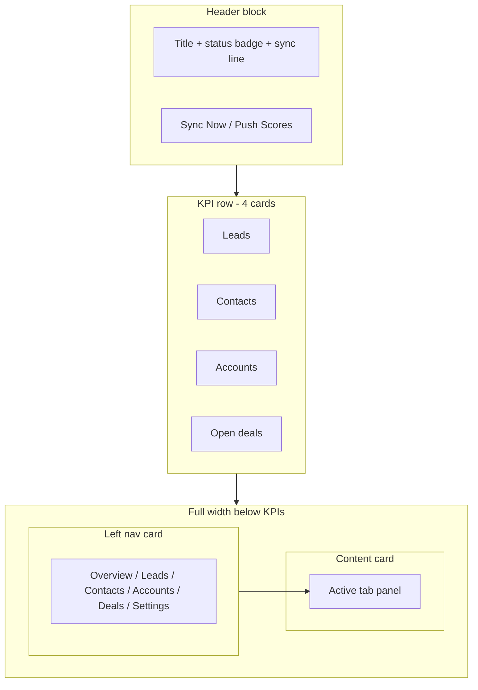

# feat: Redesign Zoho CRM page to match prior layout

## Summary

Rebuild `/zoho` as a dedicated screen (no shared `IntegrationLayout` banner) with inline connection badge beside the title, compact sync copy underneath, **Sync Now** in the header, four KPI cards in one row (Leads, Contacts, Accounts, Open deals), and a full-width **left nav + right content** shell for Overview, Leads, Contacts, Accounts, Deals, and Integration Settings — matching the attached prior design while keeping Prism tokens.

---

## Problem Frame

The current Zoho route reuses `IntegrationLayout`, which stacks a large connection card, horizontal mapping tables, and a three-metric row. That diverges from the prior product design: status lives in the header, KPIs sit immediately under the title area, and entity navigation is a vertical rail with tab content filling the remaining width. The prototype needs layout parity for demos without wiring real Zoho APIs.

---

## Requirements

- R1. Remove the `proto-int-banner` connection card from the Zoho page; connection state is expressed only in the header region.
- R2. Page title row shows **Zoho CRM** with a status pill inline (e.g. **Connected** / **Disconnected**) and one short line of sync detail directly below the title row (e.g. “Connected — syncing every 30 min” or “Last sync 12 min ago” when connected).
- R3. Primary header action is **Sync Now** (refresh icon + label), not Reconnect/Connect toggle. Disconnected state may keep **Connect** as secondary behavior; connected state shows **Sync Now** only in the primary action slot unless reference secondary actions are included (see R4).
- R4. Optional secondary header action **Push Scores** (from reference screenshot) as `btn-primary` noop — include for visual parity; no backend.
- R5. Four KPI cards in a single row directly under the header block: **Leads**, **Contacts**, **Accounts**, **Open deals** (mock counts aligned with reference order where sensible).
- R6. Replace horizontal top tabs with a **left vertical nav panel** listing: Overview, Leads, Contacts, Accounts, Deals, Integration Settings — each with icon + label, active state matching `proto-settings` / sidebar list patterns.
- R7. Tab content renders in a **right-hand panel** that uses remaining horizontal space (min-height fills content area below header/KPIs).
- R8. **Overview** tab shows “CRM Intelligence” section: KPI row is global (visible above nav split OR only in overview — prefer KPIs above nav so they stay visible on all tabs, matching reference where metrics sit above tab content; implementer may keep KPIs full-width above the split).
- R9. Overview includes **Top Industries (Accounts)** ranked list with horizontal bar visualization (mock data from reference scale).
- R10. Non-overview tabs ship credible placeholder content (table or empty state + short copy), not `ComingSoon`.
- R11. Apollo and GA routes continue using `IntegrationLayout` unchanged.
- R12. Light/dark theme and existing `Icon`, `btn-primary`, `btn-secondary`, card tokens must remain consistent.

**Origin actors:** (none)

**Origin flows:** (none)

**Origin acceptance examples:** (none)

---

## Scope Boundaries

- Zoho page only (`components/screens/ZohoIntegration.tsx`); do not redesign Apollo or GA in this change.
- No OAuth, webhooks, or live sync — mock state + local “syncing” feedback (spinner or toast-style inline message) is sufficient.
- Field mapping + activity log tables from current `IntegrationLayout` are **out of scope** for the main layout; **Integration Settings** tab may host simplified mapping/sync toggles as placeholder.

### Deferred to Follow-Up Work

- **Scored** and **Avg BP Score** KPI cards from reference (six-card row) — user asked for four entity cards only.
- Shared extraction of “integration shell” for Apollo/GA to match Zoho later.
- Automated UI tests.

---

## Context & Research

### Relevant Code and Patterns

- `components/screens/ZohoIntegration.tsx` — thin wrapper over `IntegrationLayout`; full rewrite target.
- `components/screens/IntegrationLayout.tsx` — remains for Apollo/GA; Zoho decouples.
- `components/screens/Settings.tsx` + `.proto-settings` in `app/globals.css` — left nav + right panel precedent.
- `app/globals.css` — `.tabs` / `.tab` (horizontal), `.proto-kpi-row`, `.proto-list-item`, `.page-header`, `.page-meta`.
- Reference screenshot (user attachment): CONNECTED badge beside title, Sync Now + Push Scores, vertical entity nav, Overview with industry bars and entity counts (Leads 0, Contacts 864, Accounts 606, Deals 0).

### Institutional Learnings

- None in `docs/solutions/`.

### External References

- None.

---

## Key Technical Decisions

- **Dedicated `ZohoIntegration.tsx`:** Stop using `IntegrationLayout` for Zoho so layout is not constrained by shared banner/mapping split. Keeps Apollo/GA stable.
- **KPI placement:** Full-width row **above** the left-nav / content split so metrics stay visible when switching tabs (matches reference hierarchy: header → KPIs → nav+content).
- **Nav component structure:** Colocated tab config array `{ id, label, icon }` + `switch` or record map for panel bodies; single `useState` for `activeTab`.
- **Status badge:** New `.zoho-status` (or `.proto-status-connected`) pill with dot + uppercase label; disconnected variant uses warning/danger tokens.
- **Sync Now UX:** On click, set short-lived `syncing` state; update “last sync” copy to “Syncing…” then “Last sync just now” after timeout (~1.5s) — prototype only.
- **CSS namespace:** Prefix new rules `.zoho-*` to avoid collisions with `.proto-int-*` used elsewhere.

---

## Open Questions

### Resolved During Planning

- **Reconnect button?** Replaced by Sync Now when connected; Connect only when disconnected.
- **Where do mapping/logs go?** Integration Settings tab placeholder; not in Overview.

### Deferred to Implementation

- Exact copy for disconnected sync line.
- Whether Overview also shows a condensed activity snippet (optional; not required by user).

---

## High-Level Technical Design

> *Directional guidance for review, not implementation specification.*

---

## Implementation Units

- U1. **[Decouple Zoho from IntegrationLayout]**

**Goal:** `ZohoIntegration.tsx` owns its own layout tree; Apollo/GA unchanged.

**Requirements:** R11

**Dependencies:** None

**Files:**
- Modify: `components/screens/ZohoIntegration.tsx`
- Unchanged: `components/screens/IntegrationLayout.tsx`, `components/screens/ApolloIntegration.tsx`, `components/screens/GaIntegration.tsx`

**Approach:** Remove `IntegrationLayout` import; scaffold empty sections for header, KPIs, and nav split.

**Patterns to follow:** `components/screens/Settings.tsx` structure.

**Test scenarios:**
- Test expectation: none — layout shell only; manual verify `/zoho` renders without banner card.

**Verification:** `/zoho` no longer renders `proto-int-banner`.

---

- U2. **[Header: inline status, sync line, Sync Now]**

**Goal:** Match prior design header cluster.

**Requirements:** R1, R2, R3, R4, R12

**Dependencies:** U1

**Files:**
- Modify: `components/screens/ZohoIntegration.tsx`
- Modify: `app/globals.css` (`.zoho-header`, `.zoho-status`, `.zoho-sync-line`)

**Approach:** Flex row: title + badge on same line; subtitle line removed or replaced by sync line under title block. `page-meta`: Sync Now (`btn-secondary` + `refresh` icon); Push Scores (`btn-primary` + `send` or `arrowUp` icon). Local `connected` + `lastSync` state.

**Test scenarios:**
- Happy path: connected → badge “Connected”, Sync Now visible, sync line shows schedule text.
- Happy path: click Sync Now → brief syncing state → last sync updates.
- Edge case: disconnected → badge “Disconnected”, Connect shown instead of Sync Now (acceptable prototype behavior).

**Verification:** No Reconnect label when connected; no standalone connection card.

---

- U3. **[Four KPI cards row]**

**Goal:** Leads, Contacts, Accounts, Open deals immediately under header.

**Requirements:** R5, R8, R12

**Dependencies:** U2

**Files:**
- Modify: `components/screens/ZohoIntegration.tsx`
- Modify: `app/globals.css` (`.zoho-kpi-row`, optional left accent bar per reference)

**Approach:** `proto-kpi-row` grid with `grid-template-columns: repeat(4, 1fr)` at desktop; stack on narrow breakpoints. Mock values from reference: Leads `0`, Contacts `864`, Accounts `606`, Open deals `0` (labels user-facing: “Open deals”).

**Test scenarios:**
- Happy path: four cards visible in one row at desktop width.
- Test expectation: none for automated tests.

**Verification:** Four cards, including Leads, sit above nav split with no banner between header and KPIs.

---

- U4. **[Left nav + right content shell]**

**Goal:** Full-page utilization with vertical entity navigation.

**Requirements:** R6, R7, R12

**Dependencies:** U3

**Files:**
- Modify: `components/screens/ZohoIntegration.tsx`
- Modify: `app/globals.css` (`.zoho-shell`, `.zoho-nav`, `.zoho-content` — mirror `.proto-settings` grid)

**Approach:** CSS grid `220px 1fr` (or similar); nav uses `proto-list-item` buttons with icons (`chart` Overview, `bolt` Leads, `users` Contacts, `project` Accounts, `target` Deals, `settings` Integration Settings). Content area is `card proto-panel` filling height.

**Test scenarios:**
- Happy path: click each nav item → right panel swaps without page reload.
- Edge case: narrow viewport → nav stacks above content (media query).

**Verification:** Nav is vertical left; content fills right column.

---

- U5. **[Overview tab — CRM Intelligence + Top Industries]**

**Goal:** Default tab matches reference Overview content.

**Requirements:** R8, R9, R10

**Dependencies:** U4

**Files:**
- Modify: `components/screens/ZohoIntegration.tsx`
- Modify: `app/globals.css` (`.zoho-industry-row`, `.zoho-industry-bar`)

**Approach:** Section label “CRM Intelligence” (muted uppercase). Industry list: 8 mock rows with rank, label, count, green bar width by relative count (max = top industry). Data seeded from reference top entries (information technology & services 340, etc.).

**Test scenarios:**
- Happy path: Overview selected by default; industry bars render proportional widths.

**Verification:** Overview shows ranked industries with bars, not field-mapping table.

---

- U6. **[Entity + Settings tab placeholders]**

**Goal:** Each non-overview tab has purposeful stub UI.

**Requirements:** R10

**Dependencies:** U4

**Files:**
- Modify: `components/screens/ZohoIntegration.tsx`

**Approach:**
- **Leads / Contacts / Accounts / Deals:** searchable `proto-table` with 5–8 mock rows (name, status, updated).
- **Integration Settings:** sync toggle, connect copy, compact mapping table (reuse current Zoho mapping mock), link-styled hints only.

**Test scenarios:**
- Happy path: Leads tab shows table; Settings shows toggles/mapping.

**Verification:** All six nav items show distinct content.

---

## System-Wide Impact

- **Interaction graph:** Only `/zoho` route body changes; `Shell` crumbs unchanged.
- **Unchanged invariants:** `IntegrationLayout`, Apollo, GA, sidebar, theme toggle.
- **State:** Local React state only in `ZohoIntegration.tsx`.

---

## Risks & Dependencies

| Risk | Mitigation |
|------|------------|
| KPI row wraps awkwardly below 4 columns | `repeat(4, minmax(0, 1fr))` + responsive breakpoint to 2×2 then 1 col |
| Duplicated nav pattern vs Settings | Reuse `.proto-list-item` classes; only add `.zoho-shell` grid |
| Drift from reference blue accent | Use Prism `--primary` / `--success` tokens, not foreign blue palette |

---

## Documentation / Operational Notes

- None required; optional screenshot in PR comparing to user reference.

---

## Sources & References

- User-provided prior design screenshot (Zoho CRM Overview)
- `components/screens/ZohoIntegration.tsx`, `IntegrationLayout.tsx`, `Settings.tsx`
- `app/globals.css` (`.proto-settings`, `.proto-kpi-row`, `.page-header`)
