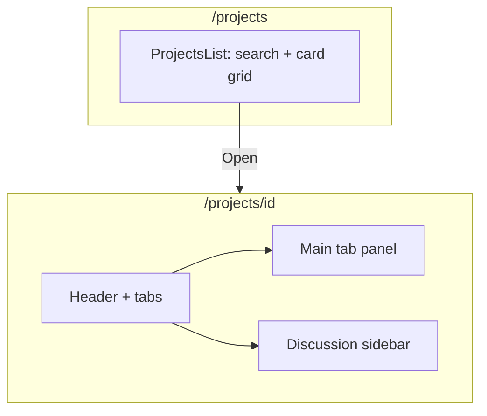

# feat: Redesign Project Management list and detail views

## Summary

Replace the current single-page kanban at `/projects` with a **project catalog grid** matching the reference list layout, then add a **dynamic project detail route** (`/projects/[id]`) that replicates the reference detail experience (header, tabs, main workspace, discussion sidebar) using Prism tokens—not the reference’s blue palette. Reuse existing kanban/task styles where they already fit; extend only where the reference layout diverges.

---

## Problem Frame

`components/screens/Projects.tsx` today is one kanban board with no project entity, no list view, and no drill-in route. The attached prior designs define a two-level IA: a searchable project card grid, then a rich project workspace with Tasks List, Kanban, Charts, Activity Log, and a collapsible Project Discussion rail. The prototype needs that flow for demos while staying visually consistent with Prism (terracotta, paper surfaces, existing buttons and cards).

---

## Requirements

- R1. `/projects` shows a **project list** page: title, subtitle, search, **All Tasks** + **New Project** actions, and a **responsive card grid** (reference: ~3 columns) with status badge, pin, title, description, date/members/tasks meta, and **Open** + edit/delete controls per card.
- R2. Clicking **Open** (or equivalent card action) navigates to `/projects/[id]` for that project.
- R3. Project detail page includes: **← Projects** back link, project title, **status badge** (e.g. PLANNED / ACTIVE), **Release** date line, header actions (**Details**, **Pin**, **Edit**, **Delete**), and horizontal **tabs** with counts: Tasks List, Kanban, Charts, Activity Log.
- R4. Detail layout uses **main column + right discussion sidebar**; sidebar has hide/show toggle, comment thread, and compose input (prototype-local state only).
- R5. **Tasks List** tab: search, Filters, **+ New Task**, horizontal task cards (reference shape) with overdue/status/assignee avatars.
- R6. **Kanban** tab: five columns (To Do, In Progress, Review, Completed, Blocked) with tinted column headers, task cards in To Do, empty states elsewhere, **+ Add task** per column—reusing/extending existing `.kanban` / `.task` patterns.
- R7. **Charts** tab: “Project Analytics” grid with four chart placeholder cards (line, horizontal bar, donut, breakdown)—CSS/mock SVG bars only, no chart library.
- R8. **Activity Log** tab: chronological activity list with user, action, timestamp (mock entries from reference).
- R9. **Re-theme only:** map reference blues to Prism `--primary`, `--info`, status tokens, and existing `btn-primary` / `btn-secondary`; do not copy foreign blue hex values as primary brand color.
- R10. `Shell` highlights **Project Management** in sidebar for any `/projects/*` path; breadcrumbs support list vs detail (detail may use in-page back link; optional Shell crumb extension for `/projects/[id]`).
- R11. Mock data only—no API, auth, or persistence.
- R12. Existing routes and sidebar entry for Project Management unchanged (`/projects`).

**Origin actors:** (none)

**Origin flows:** F1 Browse projects → open project → switch tabs / read discussion (derived from reference)

**Origin acceptance examples:** (none)

---

## Scope Boundaries

- Project Management only; no changes to Zoho, Dashboard, or other screens.
- No real charting library, WebSocket comments, or task drag-and-drop (optional static DnD deferred).
- **All Tasks** button may navigate to a filtered stub or noop with tooltip—full cross-project task hub deferred.

### Deferred to Follow-Up Work

- Full **New Project** / **New Task** modals with validation and list mutation beyond minimal local add.
- Drag-and-drop kanban and cross-project **All Tasks** view.
- `ce-demo-reel` / screenshot parity pass against reference PNGs.
- Automated tests (no test harness in repo today).

---

## Context & Research

### Relevant Code and Patterns

- `components/screens/Projects.tsx` — current kanban-only screen to replace/split.
- `app/projects/page.tsx` — thin page wrapper.
- `app/globals.css` — `.kanban`, `.column`, `.task`, `.tabs`, `.page-header`, `.search`, `.avatar-stack`, `.email-grid` (card grid density reference).
- `components/screens/ZohoIntegration.tsx` — recent pattern for split list/detail IA and `.zoho-shell`-style layout (detail main + side panel).
- `components/Shell.tsx` — static `CRUMBS`; needs prefix handling for `/projects/[id]`.
- Reference images (user attachments): list grid, detail with tabs + discussion, kanban columns, charts grid, activity log.

### Institutional Learnings

- None in `docs/solutions/`.

### External References

- None.

---

## Key Technical Decisions

- **Split screens:** `ProjectsList.tsx` (catalog) + `ProjectDetail.tsx` (workspace); optional `lib/projectsMock.ts` or `data/projectsMock.ts` for shared project/task/comment fixtures.
- **Routing:** `app/projects/[id]/page.tsx` new; `app/projects/page.tsx` imports list component.
- **Preserve kanban CSS:** Extend `.kanban` for 5-column tinted headers rather than replacing working task card styles.
- **Discussion sidebar:** Collapsible via `useState`; default visible on desktop; narrow “Hide Comments” rail when collapsed (reference behavior).
- **Charts:** Pure CSS placeholder blocks (bars/lines) inside cards—sufficient for prototype credibility.
- **Navigation:** `next/link` + `useRouter` from list cards; detail back link to `/projects`.
- **Shell crumbs:** If pathname starts with `/projects/`, use `['Discover', 'Project Management', '<short title>']` derived from mock lookup by id; `sidebarPath` = `/projects` when pathname matches `/projects/*`.

---

## Open Questions

### Resolved During Planning

- **Replace or keep old board on list page?** List page replaces kanban entirely; kanban moves to detail tab only.
- **Re-theme vs pixel-perfect?** Layout and IA follow reference; colors/components follow Prism.

### Deferred to Implementation

- Exact project count in mock grid (plan suggests 6–9 cards including hero “Cloud Shift…” project matching reference).
- Whether **Details** header dropdown shows static menu items only.

---

## High-Level Technical Design

> *Directional guidance for review, not implementation specification.*

---

## Output Structure

    app/projects/page.tsx
    app/projects/[id]/page.tsx
    components/screens/ProjectsList.tsx
    components/screens/ProjectDetail.tsx
    components/screens/project/ProjectDiscussion.tsx   # optional extract
    data/projectsMock.ts                               # optional shared fixtures
    app/globals.css                                    # .proj-* extensions

---

## Implementation Units

- U1. **[Routing, mock data, and Shell integration]**

**Goal:** Enable list → detail navigation with shared fixtures and correct chrome.

**Requirements:** R2, R10, R12

**Dependencies:** None

**Files:**
- Create: `app/projects/[id]/page.tsx`
- Create: `data/projectsMock.ts` (or colocated mocks in list/detail if preferred)
- Modify: `app/projects/page.tsx`
- Modify: `components/Shell.tsx`

**Approach:** Export `PROJECTS` array with `id`, slug, title, status, release, description, counts, pinned. Detail page reads `params.id`. Shell: if `pathname.startsWith('/projects/')`, set crumbs and `sidebarPath = '/projects'`.

**Test scenarios:**
- Happy path: `/projects/cloud-shift-website` renders detail; sidebar still highlights Project Management.
- Edge case: unknown id → friendly not-found or redirect to `/projects`.

**Verification:** Navigation works; Shell behavior correct on detail URLs.

---

- U2. **[Projects list page — card grid catalog]**

**Goal:** Main `/projects` view matches reference list layout with Prism theme.

**Requirements:** R1, R9, R11

**Dependencies:** U1

**Files:**
- Create: `components/screens/ProjectsList.tsx`
- Modify: `components/screens/Projects.tsx` (remove or re-export list only—prefer delete/rename to avoid duplicate)
- Modify: `app/globals.css` (`.proj-grid`, `.proj-card`, `.proj-card-foot`)

**Approach:** Header per reference copy (“Create and manage your projects and tasks”). Toolbar: full-width search. Actions: All Tasks (`btn-secondary`), New Project (`btn-primary`). Cards: status pill, pin icon, title, truncated description, meta row (cal/users/check icons), footer with Open (`Link` to `/projects/[id]`), edit/delete icon buttons (noop). Responsive `grid-template-columns: repeat(auto-fill, minmax(300px, 1fr))`.

**Patterns to follow:** `components/screens/Tools.tsx` grid, `Email.tsx` card meta rows.

**Test scenarios:**
- Happy path: search filters cards by title/description.
- Happy path: Open navigates to detail.

**Verification:** `/projects` shows card grid, not kanban.

---

- U3. **[Project detail shell — header, tabs, layout]**

**Goal:** Detail frame with back link, actions, tabs, main + sidebar grid.

**Requirements:** R3, R4, R9

**Dependencies:** U1

**Files:**
- Create: `components/screens/ProjectDetail.tsx`
- Modify: `app/globals.css` (`.proj-detail`, `.proj-detail-main`, `.proj-discussion`, `.proj-back`)

**Approach:** Load project by id from mock. Header: Link “← Projects”, title row + status badge, release line, action button group. Tabs reuse `.tabs` / `.tab` with badge counts. Body: CSS grid `1fr 320px` (discussion width), collapsible to icon rail. Tab state in `useState`.

**Verification:** Detail shell renders for mock project; tabs switch without route change.

---

- U4. **[Tasks List tab]**

**Goal:** Horizontal task cards with search/filter/new task bar.

**Requirements:** R5, R9

**Dependencies:** U3

**Files:**
- Modify: `components/screens/ProjectDetail.tsx`
- Modify: `app/globals.css` (`.proj-task-row`, `.proj-task-card`)

**Approach:** Mock 2+ tasks from reference (REVOPS…, etc.): title, Feature tag, Overdue line, status dropdown (local state), avatar stack. Toolbar matches reference.

**Verification:** Tasks List tab matches reference structure.

---

- U5. **[Kanban tab — five columns]**

**Goal:** Reference kanban with column colors and empty states.

**Requirements:** R6, R9

**Dependencies:** U3

**Files:**
- Modify: `components/screens/ProjectDetail.tsx`
- Modify: `app/globals.css` (extend `.kanban` for 5 cols, `.column--todo`, `.column--progress`, etc.)

**Approach:** Reuse `TaskCard` pattern from old `Projects.tsx` (extract or duplicate). Column config: todo/prog/review/done/blocked with pastel header backgrounds using Prism-tinted CSS variables. Empty column: centered icon + “Nothing here yet”. Horizontal scroll if needed on narrow viewports.

**Patterns to follow:** Existing `.kanban`, `.column`, `.task` in `globals.css`.

**Verification:** Kanban tab shows 5 columns; To Do has cards.

---

- U6. **[Charts tab — analytics placeholders]**

**Goal:** Four-card analytics grid credible without a chart lib.

**Requirements:** R7, R9

**Dependencies:** U3

**Files:**
- Modify: `components/screens/ProjectDetail.tsx`
- Modify: `app/globals.css` (`.proj-chart-grid`, `.proj-chart-card`, mock bar/line elements)

**Approach:** Section title “Project Analytics”. Cards: Activity Over Time (fake line), Activity by Team Member (horizontal bars), Task Status Distribution (donut via CSS conic-gradient), Actions Breakdown (bars). Static labels from reference.

**Verification:** Charts tab shows 2×2 grid of chart cards.

---

- U7. **[Activity Log tab]**

**Goal:** Timestamped activity feed.

**Requirements:** R8, R9

**Dependencies:** U3

**Files:**
- Modify: `components/screens/ProjectDetail.tsx`
- Modify: `app/globals.css` (`.proj-activity-list`, `.proj-activity-item`)

**Approach:** List entries with blue dot, bold user name, action text, muted timestamp; dividers between items. Seed ~6–8 mock events from reference narrative.

**Verification:** Activity Log tab readable and scrollable.

---

- U8. **[Project Discussion sidebar]**

**Goal:** Right rail comments with hide/show and compose stub.

**Requirements:** R4, R9, R11

**Dependencies:** U3

**Files:**
- Create: `components/screens/project/ProjectDiscussion.tsx` (recommended)
- Modify: `components/screens/ProjectDetail.tsx`
- Modify: `app/globals.css` (`.proj-comment`, `.proj-discussion-toggle`)

**Approach:** Comment cards: avatar initials, name, date, body, Reply/Resolve links (noop). Footer: textarea + Comment button (adds to local list optional). Vertical “Hide Comments” / “Show Comments” control collapses width. Re-theme border/accent to `--primary`.

**Verification:** Sidebar toggles; comments render; compose does not require backend.

---

## System-Wide Impact

- **Interaction graph:** `Shell` pathname logic; new dynamic segment under `/projects`.
- **Unchanged invariants:** Sidebar nav href `/projects`; other screens untouched.
- **Migration:** Remove or gut old `Projects.tsx` kanban-as-home to avoid duplicate UX.

---

## Risks & Dependencies

| Risk | Mitigation |
|------|------------|
| Five-column kanban overflows on laptop | `overflow-x: auto` on kanban row; min column width |
| Shell crumbs unknown for dynamic ids | Resolve title from mock map; fallback to “Project” |
| Large single `ProjectDetail.tsx` file | Extract `ProjectDiscussion` + tab panel subcomponents when >400 lines |
| Reference blue baked into copy | Explicit R9 + code review against `var(--primary)` |

---

## Documentation / Operational Notes

- Manual test path: `/projects` → Open hero project → each tab + collapse discussion.

---

## Sources & References

- User reference screenshots (list, detail tasks, kanban, charts, activity log)
- `components/screens/Projects.tsx`, `app/projects/page.tsx`, `components/Shell.tsx`
- `app/globals.css` (kanban/task/tabs)
